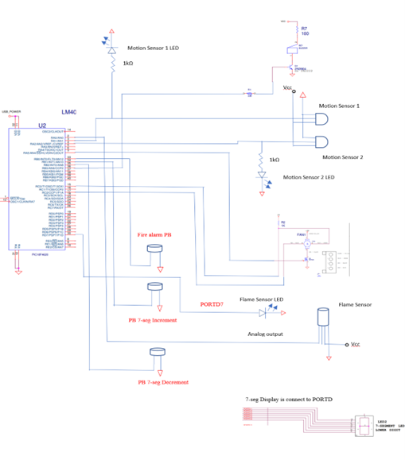
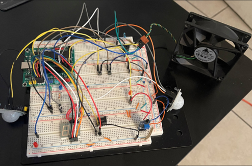
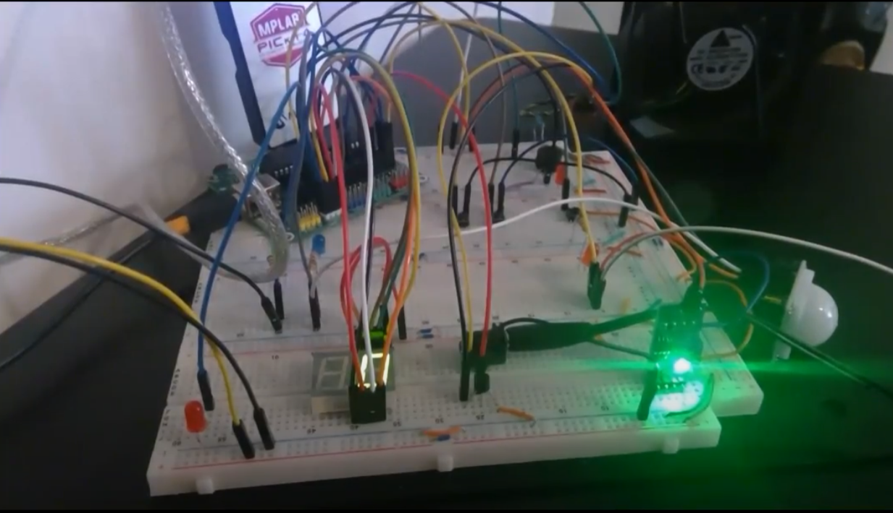

# Fire-Detector 
by Benson Thong

## Project Description
<br/> The Fire Detector project is based on a real life simulation of a fire alarm and how it would behave when a flame is detected. A person counter and fan extinguisher features were added to showcase the value of a microcontroller. The Fire detector uses the pic18f4820 microcontroller to perform a fan extinguisher for a fire which is a simulation of the fire sprinkler when a fire is detected. There are many characteristics for a fire such as temperature, smoke, flame, oxygen, etc. In this case, a flame sensor is utilized to detect a fire. Once the flame sensor is triggered, the flashing effect of a fire alarm will turn on using a LED and buzzer. Furthermore, the fan extinguisher will be setup towards the flame sensor to extinguish the fire. The person counter is used to count the number of people in a building such that when a fire is detected, it will notify security how many people needs to be evacuated. This is implemented using a simple push button and is required to be pressed when a person enters/exits the building. In hopes of near feature, a motion sensor will be used instead of a push button and an IoT device to show real-time data of people entering/exiting the building.

### Hardware Used
- pic18f4820 microcontroller development board
- PICkit 4
- 4-pin fan
- 2n7000 FET
- 7-segment displays
- flame sensor
- LED
- Buzzer

### Software Used 
- MPLAB X IDE v4.20 was used to program the PICkit4 in order to debug the hardware and software for the pic18f4820 microcontroller. The code was built using C and can be found in the path ```Firedetector2.X/FireDetector2.c```
- Concepts used for this project to work: uart, external interrupts, software ADC, and system timer.
  - uart was used to view the ADC voltage when a flame sensor is triggered.
  - external interrupts is used to allow a manual alarm to trigger in the case the flame sensor malfunctions.
  - created and utilized the ADC of the pic18f to generate a digital value of a voltage using ADCON0. 
  - System timer was used to generate a concise time of 1 second in order for a functional flashing and beeping effect for the fire alarm.
  - Configurations, libraries, and ports used are defined in Lines 1 to 18.
  
## Project Schematic


## Project Setup



